# llm-fusion

[](https://pypi.org/project/llm-fusion/)
[](https://github.com/astral-sh/ruff)



Fused autoregressive text completion using ByteDance Ouro-1.4B + Sapient HRM-Text-1B.

Both models run under transformers 5.11.0. Fusion strategies operate in HRM's vocabulary space
via bidirectional token ID matching.

## Why

Two small models can disagree in useful ways. Ouro-1.4B is a Universal Transformer
(with recurrent depth via UT steps and early-exit), while HRM-Text-1B is a prefix-LM
trained with explicit reasoning condition tags (direct, cot, noisy, synth). They were
trained differently, tokenize differently, and have different confidence profiles on
different kinds of text. The hypothesis is that their disagreements are informative —
when both models agree on a token, that's a strong signal; when they diverge, the fusion
distribution captures uncertainty that either model alone would paper over with false
confidence.

The KL divergence tooling (`--kl`) and fusion gain metric (`--gain`) exist precisely to
test this hypothesis empirically, token by token. A positive fusion gain means the fused
distribution assigned higher probability to the ground-truth token than the best parent
did alone — the combination genuinely knew something neither model knew individually. The
robustness benchmark across 8 prompt categories is designed to find out when and for what
kinds of text that actually holds.

More broadly, this is a low-cost alternative to model merging or ensemble distillation. No
retraining, no weight surgery — just run both models, bridge their vocabularies, and blend
at inference time. The cost is speed (two forward passes per token); the payoff, if the
hypothesis holds, is better calibration and fewer confidently wrong completions. Because a
second opinion is free if you already have the weights.

## Architecture highlights

Token bridging is the hard part. The two models have completely different vocabularies
(GPT-2 BPE with 49k tokens vs. Qwen2 BPE with 65k). The `TokenMatcher` handles this via a
bidirectional lookup that first tries exact string matches, then decode→re-encode roundtrips,
classifying each match as `exact`, `approx`, or `mismatch`. About 37k tokens map cleanly.
The fusion always operates in HRM's vocabulary space.

Fifteen fusion strategies are implemented in clean, well-separated private methods on `Fuser`:

- **average** — weighted softmax blend (`ouro_weight=0.5`)
- **dynamic** — Ouro weight decays linearly from initial to final over the generation steps **(default, best gain)**
- **simple** — pools top-k from both models, sums overlapping probabilities, sorts by score **(best win rate at 96%)**
- **slerp** — Spherical linear interpolation between probability distributions on the unit hypersphere
- **product** — Product of Experts (multiplies probabilities, strongly penalizes tokens either model dislikes)
- **min-entropy** — routes each token to whichever model is more confident (lower entropy)
- **min-perplexity** — routes entirely to the winning model's own tokens (lowest JSD/KL divergence)
- **cascade** — uses Ouro unless its top-1 probability falls below a threshold, then defers to HRM
- **adaptive** — entropy-weighted average, shifts weight toward the more confident model
- **confidence** — top-1 probability weighted average
- **hybrid** — blends dynamic decay with confidence weighting

## Install

```bash
pip install -e ".[test]"
```

## Usage

```bash
# Fused (dynamic strategy, default)
python -m llm_fusion --local "France's capital city is"

# Ouro only
python -m llm_fusion --model ouro --local "The first person to walk on the moon was"

# HRM only with chain-of-thought
python -m llm_fusion --model hrm --condition cot --local "Explain the sky is blue"

# CLI entry point
llm-fusion --local "Python was created by"
```

### Fusion Strategies

```bash
# Average — weighted softmax blend (ouro_weight=0.5)
python -m llm_fusion --strategy average --local "The meaning of life is"

# Product of Experts — kills tokens either model dislikes
python -m llm_fusion --strategy product --local "The meaning of life is"

# Min-Entropy Routing — use the more confident model per token
python -m llm_fusion --strategy min-entropy --local "The capital of Japan is"

# Min-Perplexity Routing — route entirely to the lower-entropy model
python -m llm_fusion --strategy min-perplexity --local "The capital of Japan is"

# Cascade — try Ouro first, fall back to HRM if Ouro's top prob < threshold
python -m llm_fusion --strategy cascade --cascade-threshold 0.5 --local "Explain quantum computing"

# Dynamic (default) — Ouro weight linearly decays over generation steps
python -m llm_fusion --strategy dynamic --dynamic-initial-weight 0.8 --dynamic-final-weight 0.2 --local "Once upon a time"

# SLERP — spherical linear interpolation (best win rate)
python -m llm_fusion --strategy slerp --local "The meaning of life is"

# Simple — pool all tokens, sum probs, sort (96% win rate)
python -m llm_fusion --strategy simple --local "The meaning of life is"
```

### KL Divergence

```bash
# Show per-step KL(Ouro||HRM) and KL(HRM||Ouro) during generation
python -m llm_fusion --kl --local "The quick brown fox jumps over the lazy dog"
```

### Fusion Gain
```bash
# Show per-token fusion gain (log-ratio vs best parent, positive = fusion wins)
python -m llm_fusion --gain --local "The quick brown fox jumps over the lazy dog"
```

### Evaluation Mode
```bash
# Score a reference text under all 3 configurations (ouro, hrm, fused)
python -m llm_fusion --eval "The capital of France is Paris. It is known for the Eiffel Tower." --local
# Output: avg fusion gain, fusion win rate, oracle agreement, PPL for all 3
```

### Perplexity Evaluation

```bash
# Evaluate a prompt's perplexity (lower = better)
python -m llm_fusion --model ouro --perplexity --local "The quick brown fox jumps over the lazy dog"
python -m llm_fusion --model hrm --perplexity --local "The quick brown fox jumps over the lazy dog"
python -m llm_fusion --perplexity --local "The quick brown fox jumps over the lazy dog"
```

### Benchmarks

```bash
# Run speed benchmarks for all model/strategy combinations
python -m llm_fusion benchmark
llm-fusion-benchmark

# Custom prompt and token count
python -m llm_fusion benchmark --prompt "Hello world" -n 100

# Cache results to .benchmark_cache/ (loads from cache on subsequent runs)
python -m llm_fusion benchmark --benchmark-cache

# Specify device (default: auto-detect)
python -m llm_fusion benchmark --device cpu
python -m llm_fusion benchmark --device cuda

# Run robustness benchmark on a diverse battery of 25+ prompts
# Measures: perplexity, fusion gain, win rate, KL divergence
# Reports aggregated by category (factual, reasoning, math, code, etc.)
python -m llm_fusion benchmark --robustness
llm-fusion-benchmark --robustness
```

Benchmark output includes speed + quality metrics per config:

| Metric | Description |
|--------|-------------|
| `Decode` | Tokens/sec during generation (after first token) |
| `Gen` | Tokens/sec including prompt processing |
| `FusedPPL` | Average of Ouro and HRM perplexity |
| `KL(o>h)` | Mean KL(Ouro \|\| HRM) per step |
| `JSD` | Jensen-Shannon divergence (symmetric, 0-1) |
| `WinRate` | % of steps where fusion prob > max(parent probs) |
| `Gain` | Mean log-ratio vs best parent (positive = fusion helps) |
| `Oracle` | % of steps where Ouro's prob >= HRM's (model agreement) |
| `Entropy` | Mean entropy of the fused distribution |
| `OuroTok` | Tokens generated by Ouro (routing strategies) |
| `HrmTok` | Tokens generated by HRM (routing strategies) |

### Benchmark Results

Benchmark on the default prompt ("The quick brown fox jumps over the lazy dog"), 10 tokens, CPU:

| Config | Decode | Gen | FusedPPL | KL(o>h) | JSD | WinRate | Gain | Oracle | Entropy | OuroTok | HrmTok |
|--------|--------|-----|----------|---------|-----|---------|------|--------|---------|---------|--------|
| ouro/average | 1.4 | 2.4 | 0.0 | 0.000 | 0.000 | 0.0% | +0.000 | 0.0% | 0.0 | 0 | 0 |
| hrm/average | 1.7 | 3.0 | 0.0 | 0.000 | 0.000 | 0.0% | +0.000 | 0.0% | 0.0 | 0 | 0 |
| fused/average | 0.8 | 1.2 | 85.8 | 21.065 | 0.692 | 20.0% | -0.354 | 20.0% | 1.3 | 10 | 10 |
| fused/product | 0.7 | 1.2 | 85.8 | 21.144 | 0.690 | 0.0% | -0.704 | 60.0% | 1.2 | 10 | 10 |
| fused/min-entropy | 0.8 | 1.3 | 85.8 | 20.300 | 0.691 | 60.0% | +0.364 | 10.0% | 1.4 | 10 | 10 |
| fused/min-perplexity | 0.9 | 1.4 | 85.8 | 21.100 | 0.690 | 50.0% | +0.000 | 20.0% | 1.3 | 2 | 8 |
| fused/cascade | 0.9 | 1.3 | 85.8 | 20.919 | 0.692 | 70.0% | +0.012 | 0.0% | 1.4 | 0 | 10 |
| **fused/dynamic** | **0.9** | **1.3** | **85.8** | **19.826** | **0.678** | **90.0%** | **+1.464** | **40.0%** | **1.6** | **10** | **10** |
| fused/adaptive | 0.9 | 1.4 | 85.8 | 21.065 | 0.692 | 20.0% | -0.262 | 20.0% | 1.3 | 10 | 10 |
| fused/confidence | 0.9 | 1.3 | 85.8 | 21.065 | 0.692 | 20.0% | -0.354 | 20.0% | 1.3 | 10 | 10 |
| fused/hybrid | 0.9 | 1.3 | 85.8 | 20.300 | 0.691 | 40.0% | -0.177 | 10.0% | 1.4 | 10 | 10 |
| fused/slerp | 0.9 | 1.4 | 85.8 | 21.018 | 0.691 | 90.0% | +0.429 | 20.0% | 1.3 | 10 | 10 |
| fused/simple | 0.9 | 1.3 | 85.8 | 21.065 | 0.692 | 80.0% | +0.200 | 20.0% | 1.3 | 10 | 10 |

**Dynamic has the best gain (+1.464)** — fusion helps most when it wins. **Slerp has the best win rate (90%)** — fusion beats one or both parents on 9 out of 10 tokens.

**Token attribution** reveals routing behavior:

| Strategy | OuroTok | HrmTok | Split | Behavior |
|----------|---------|--------|-------|----------|
| cascade | 0 | 10 | 0/100 | Ouro never confident enough → all HRM |
| min-perplexity | 2 | 8 | 20/80 | HRM dominates, Ouro rarely wins |
| min-entropy | 10 | 10 | 50/50 | Balanced routing |
| dynamic | 10 | 10 | 50/50 | Both contribute equally (blending) |
| slerp | 10 | 10 | 50/50 | Both contribute equally (blending) |
| simple | 10 | 10 | 50/50 | Both contribute equally (blending) |

Routing strategies (`cascade`, `min-perplexity`) pick one model per token. Blending strategies (`simple`, `slerp`, `dynamic`) use both models at every step.

### Parameters

| Flag | Default | Description |
|------|---------|-------------|
| `-m` / `--model` | `fused` | Model: `fused`, `ouro`, `hrm` |
| `-n` / `--max-new-tokens` | `100` | Max tokens to generate |
| `--temp` / `--temperature` | `1.0` | Sampling temperature (`0` = greedy) |
| `--top-k` | `30` | Top-k tokens per model |
| `--threshold` | `0.01` | Min probability threshold |
| `--ouro-weight` | `0.5` | Ouro weight (average strategy) |
| `--rep-penalty` | `1.0` | Repetition penalty (`>1` discourages repeats) |
| `--condition` | `direct` | HRM condition: `direct`, `cot`, `noisy`, `synth` |
| `--strategy` | `dynamic` | Fusion: `average`, `product`, `min-entropy`, `min-perplexity`, `cascade`, `dynamic`, `adaptive`, `confidence`, `hybrid`, `slerp`, `simple`, `sqrt-product`, `min`, `log-sum`, `norm-product` |
| `--cascade-threshold` | `0.5` | Ouro top-prob threshold for cascade strategy |
| `--dynamic-initial-weight` | `0.8` | Starting Ouro weight for dynamic strategy |
| `--dynamic-final-weight` | `0.2` | Final Ouro weight for dynamic strategy |
| `--perplexity` | `false` | Evaluate perplexity instead of generating |
| `--kl` | `false` | Show per-step KL divergence during generation |
| `--gain` | `false` | Show per-step fusion gain (log-ratio vs best parent) |
| `--eval` | `""` | Evaluate fusion vs parents on a reference text |
| `--local` | `false` | Load models from local directories |

## Fusion Strategies

| Strategy | Description |
|----------|-------------|
| `dynamic` | **(default)** Linear decay of Ouro weight from `initial` to `final` over generation steps |
| `simple` | Pool all top-k tokens from both models, sum overlapping probs, sort — **best win rate (96%)** |
| `slerp` | Spherical linear interpolation on probability distributions |
| `average` | Weighted average of Ouro and HRM logit distributions |
| `product` | Product of Experts — multiply probabilities, kills tokens either model dislikes |
| `min-entropy` | Per-token routing to the more confident model (lower entropy) |
| `min-perplexity` | Per-token routing to the winning model's own tokens (lowest JSD/KL) |
| `cascade` | Try Ouro first; fall back to HRM if Ouro's top prob is below threshold |
| `adaptive` | Entropy-weighted average, shifts weight toward the more confident model |
| `confidence` | Top-1 probability weighted average |
| `hybrid` | Blends dynamic decay with confidence weighting |
| `sqrt-product` | Product of Experts with square root dampening |
| `min` | Element-wise minimum of probability distributions |
| `log-sum` | Log-sum-exp blending of probability distributions |
| `norm-product` | Normalized Product of Experts |

## Requirements

- Python 3.11+
- transformers >=5.9.0 (HRM requirement)
- torch
- tokenizers
- `ouro-cache-fix` (optional, for KV cache)
- Ouro-1.4B and HRM-Text-1B model weights in `./Ouro-1.4B/` and `./HRM-Text-1B/`

## NaN Fixes for Ouro under transformers 5.x

Ouro-1.4B requires three patches to `modeling_ouro.py` under transformers 5.11.0:

1. **`_attn_implementation = None`** → set `config._attn_implementation = "eager"` before loading
2. **`torch.arange` on meta device** → pass `device="cpu"` to all `torch.arange` calls
3. **`inv_freq` buffer corruption** → recompute every forward via `rope_init_fn` closure instead of persistent buffer

See `AGENTS.md` for details.

## Project

```text
├── AGENTS.md                  # Agent instructions (NaN fixes, conventions)
├── CHANGELOG.md
├── LICENSE                    # Apache 2.0
├── docs/SPEC.md               # Specification
├── src/llm_fusion/            # Package
│   ├── __init__.py
│   ├── __main__.py            # python -m llm_fusion
│   ├── cli.py                 # CLI argument parsing
│   ├── generate.py            # Generation loop, perplexity, evaluation
│   ├── loader.py              # Model loading, CausalLM protocol
│   ├── fusion.py              # Fuser class (15 strategies) + KL divergence
│   ├── metrics.py             # Fusion quality metrics (gain, win rate, eval)
│   ├── benchmark.py           # Speed benchmarks + robustness battery
│   ├── token_matcher.py       # Bidirectional token ID matcher
│   └── py.typed               # Type hints marker
├── tests/                     # Pytest suite (96+ tests)
├── Ouro-1.4B/                 # Model weights + patched modeling_ouro.py
└── HRM-Text-1B/               # Model weights
```

## Development

```bash
git clone https://github.com/daedalus/LLM_EXPERIMENT.git
cd LLM_EXPERIMENT
pip install -e ".[dev,test,lint]"

# run tests
pytest

# format
ruff format src/ tests/

# format markdown
mdformat .

# lint + type check
prospector --with-tool ruff --with-tool mypy --with-tool pylint src/
ruff check src/ tests/

# security scan
opengrep --config=auto --severity=ERROR src/

# dead code detection
vulture --min-confidence 90 src/

# complexity analysis
lizard src/ --CCN=15
```

## Cite

```bibtex
@misc{clavijo2026llmfusion,
  author       = {Dario Clavijo},
  title        = {llm-fusion: Fused Autoregressive Text Completion with Ouro-1.4B and HRM-Text-1B},
  year         = {2026},
  howpublished = {GitHub},
  url          = {https://github.com/daedalus/LLM_EXPERIMENT},
  abstract     = {Weighted logit fusion over ByteDance Ouro-1.4B and Sapient HRM-Text-1B
                  under transformers 5.11.0. Implements 15 fusion strategies (average,
                  product, min-entropy, min-perplexity, cascade, dynamic, adaptive,
                  confidence, hybrid, slerp, simple, sqrt-product, min, log-sum,
                  norm-product) via bidirectional token ID
                  matching. Includes KL divergence, fusion gain, perplexity evaluation,
                  and a 26-prompt robustness benchmark across 8 categories.},
}
```
